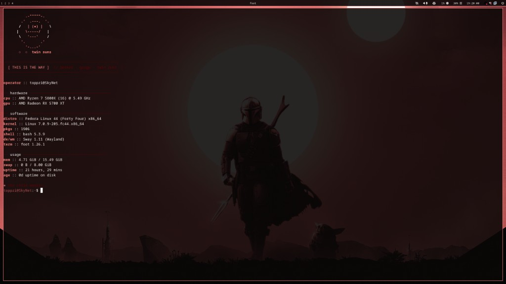
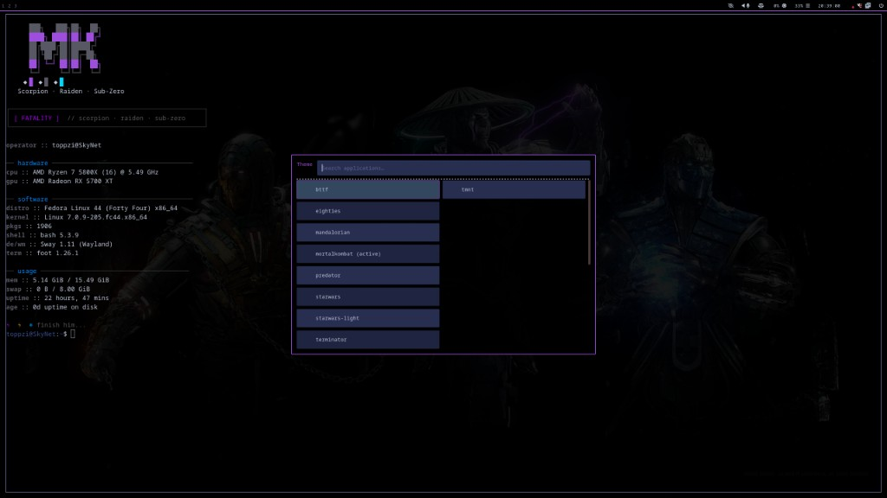
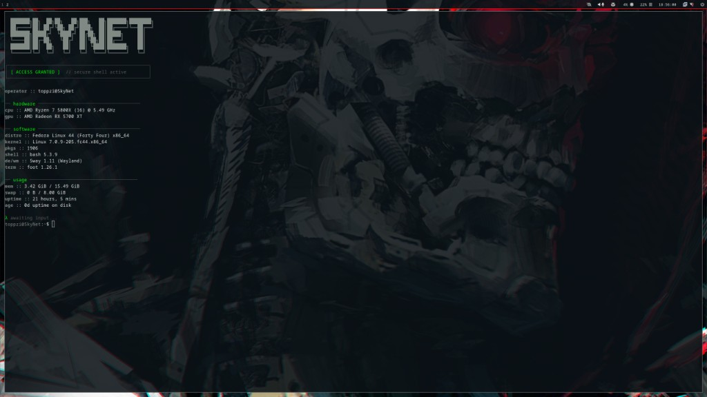
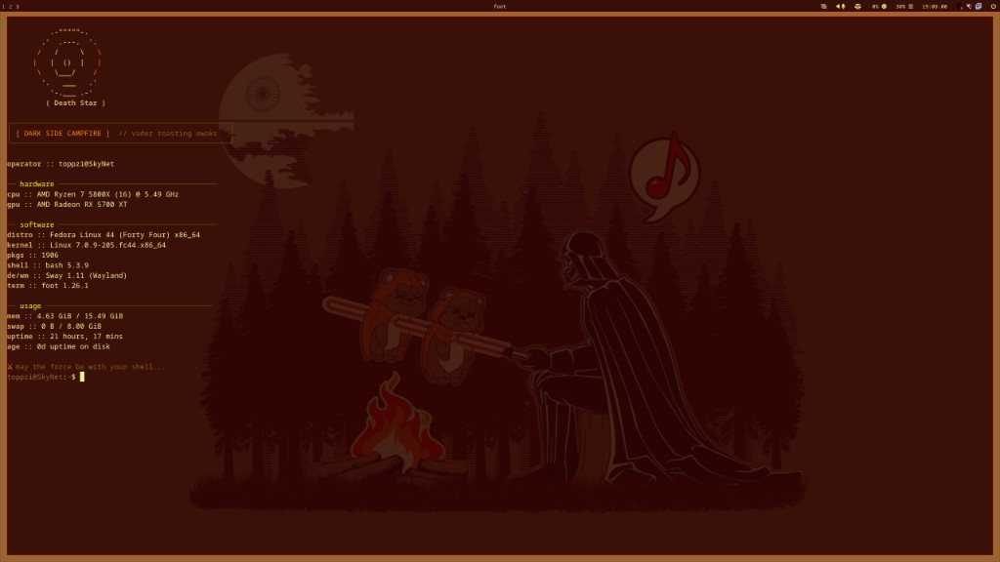
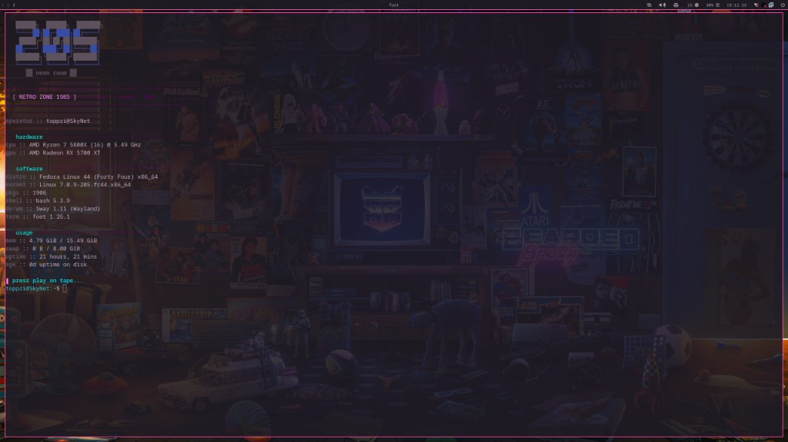
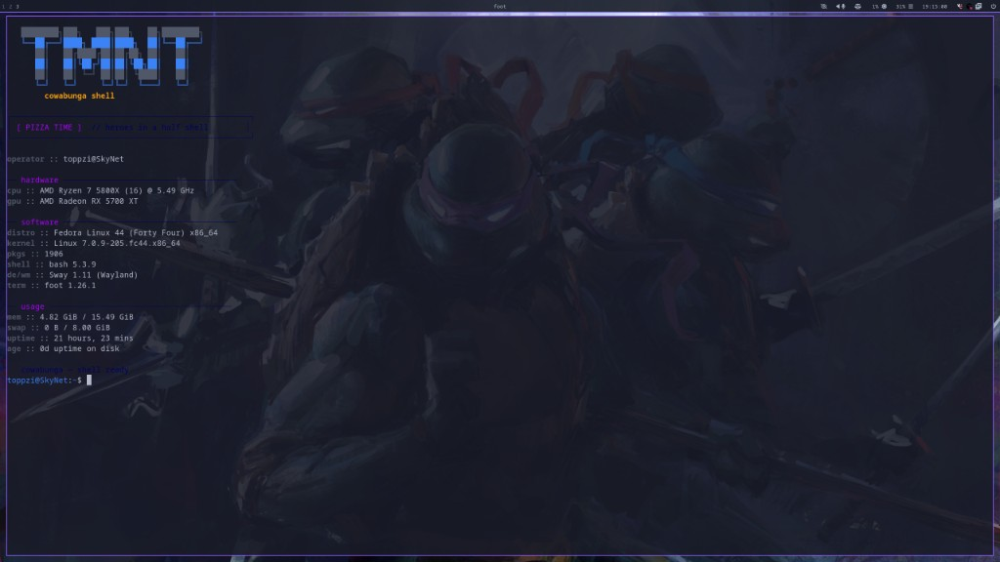
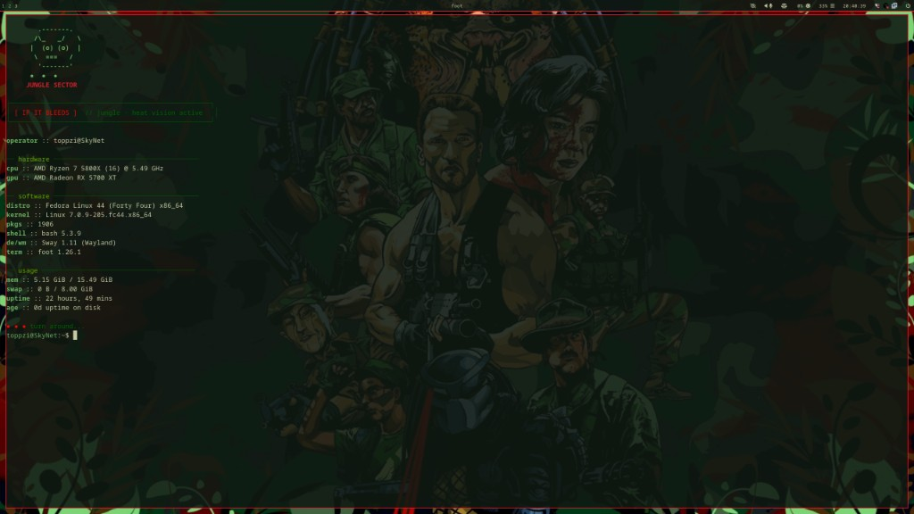
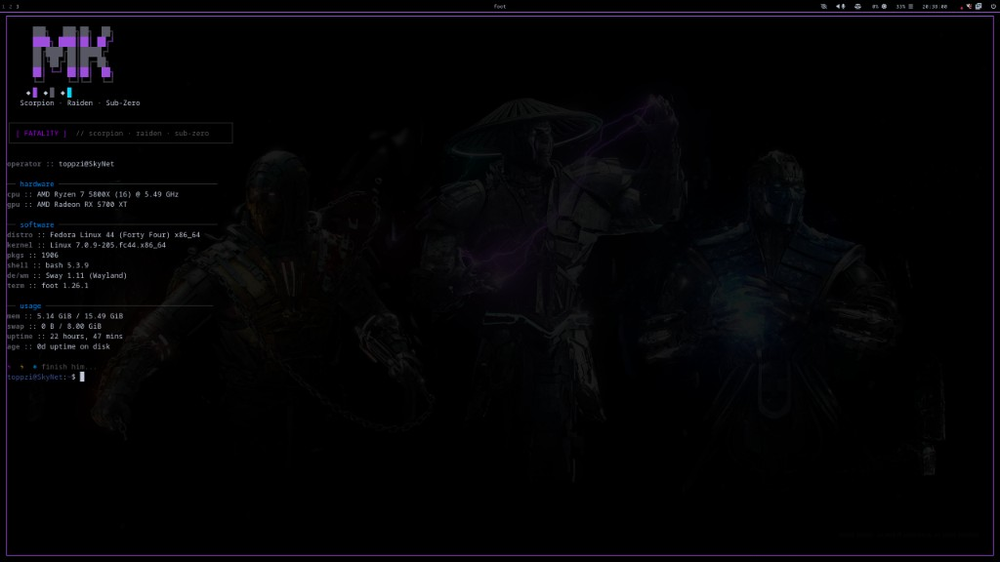
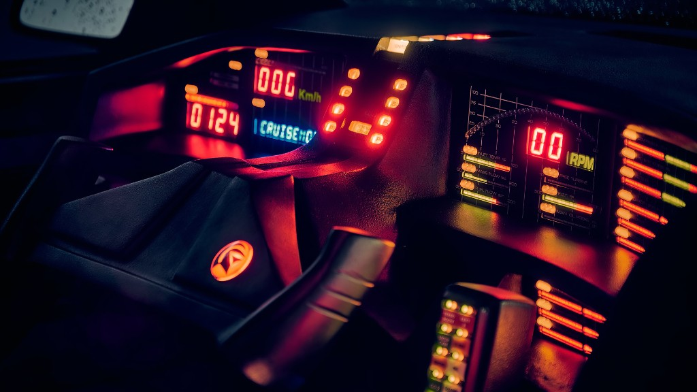
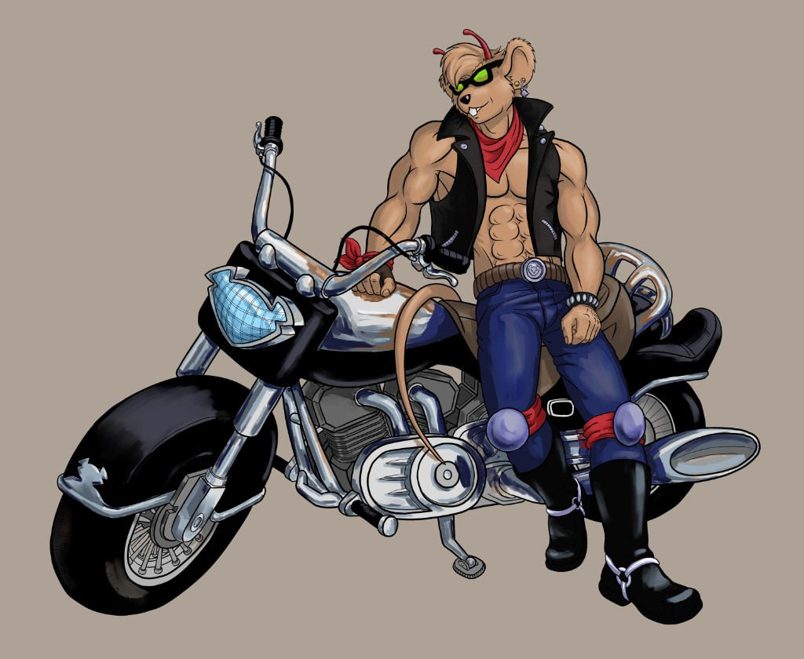

# SwayMovies

Movie-themed dotfiles for **Sway** on Fedora/Linux. One command switches wallpaper, Sway borders, Waybar, Kitty, Rofi, GTK/Thunar, fastfetch, and (optionally) the SDDM login background.

<p align="center">
  
</p>

## Screenshots

**Theme menu** — **Super+Shift+T** opens the picker; the active theme is restored on login.

<p align="center">
  
</p>

| Theme | Preview |
|-------|---------|
| **Terminator** / Skynet |  |
| **Star Wars** (dark) |  |
| **The Mandalorian** |  |
| **Retro 80s** |  |
| **Teenage Mutant Ninja Turtles** |  |
| **Predator** |  |
| **Mortal Kombat** |  |
| **Knight Rider** |  |
| **Biker Mice from Mars** |  |

Also included (no screenshot yet): `bttf`, `starwars-light`.

## Features

- **11 movie themes** — shared color palette drives Kitty, Waybar, Sway, Rofi, and GTK
- **Kitty terminal** — per-theme `kitty.conf` generated from the palette; open windows recolor on theme change
- **Floating Waybar** — workspaces, window title, and status modules (CPU, RAM, network, battery)
- **GTK / Thunar** — dark/light GTK via `adw-gtk3`; sidebar fixes for apps like Lutris
- **Workspace routing** — Firefox, Steam, dev tools, chat apps land on the right workspace
- **Login persistence** — last theme reapplied when Sway starts
- **SDDM sync** — optional script to match the login wallpaper to the active theme

## Themes

| ID | Movie / style |
|----|----------------|
| `terminator` | Terminator / Skynet |
| `starwars` | Star Wars (dark) |
| `starwars-light` | Star Wars — Hoth / X-wing (light palette) |
| `mandalorian` | The Mandalorian |
| `eighties` | Retro 80s room |
| `tmnt` | Teenage Mutant Ninja Turtles |
| `bttf` | Back to the Future Part III |
| `predator` | Predator — jungle |
| `mortalkombat` | Mortal Kombat |
| `bikermice` | Biker Mice from Mars |
| `knightrider` | Knight Rider — KITT dashboard |

## Requirements

- [Sway](https://github.com/swaywm/sway)
- [waybar](https://github.com/Alexays/Waybar)
- [kitty](https://sw.kovidgoyal.net/kitty/)
- [rofi](https://github.com/davatorium/rofi) (Wayland)
- [fastfetch](https://github.com/fastfetch-cli/fastfetch) (optional)
- `swaybg`, `notify-send`, ImageMagick (optional, for screenshots)
- `mate-polkit` (recommended on Fedora 41+, for privilege prompts in Sway; replaces removed `polkit-gnome`)
- `xorg-x11-server-utils` (provides `xrandr`; **required** for Lutris to start on Wayland)
- `NetworkManager-applet` (optional tray icon; `nm-applet`)
- `sddm` (optional, for themed login screen sync via `sddm-sync.sh`)

## Install

```bash
git clone https://github.com/toppzi/SwayMovies.git
cd SwayMovies
./install.sh
```

Then edit `~/.config/sway/config` for your monitors (see `config/sway/config.example`), reload Sway:

```bash
swaymsg reload
```

Add wallpapers to `~/Pictures/Wallpapers/` (see [wallpapers/README.md](wallpapers/README.md)).

`install.sh` copies Sway snippets, the theme switcher, Waybar config, Kitty/GTK assets, and `~/.local/bin/steam-with-chat`. Paths in repo files use `@HOME@` and are expanded on install.

## Usage

| Action | Command / key |
|--------|----------------|
| Theme menu | **Super+Shift+T** |
| List themes | `~/.config/theme-switch/theme-switch.sh list` |
| Apply theme | `~/.config/theme-switch/theme-switch.sh starwars` |
| Current theme | `~/.config/theme-switch/theme-switch.sh current` |
| Firefox (Media ws) | **Super+B** |
| Thunar (Main ws) | **Super+Shift+F** |
| Vesktop (Chat ws) | **Super+Shift+D** |
| Steam (Games ws) | **Super+G** |
| Steam + Friends layout | **Super+Shift+S** |
| Login theme restore | Automatic on Sway start (`~/.local/state/theme-switch/current`) |
| Sync SDDM login wallpaper | `sudo ~/.config/theme-switch/sddm-sync.sh` |

Open a **new Kitty** window after switching for a fresh shell + fastfetch. Running Kitty windows usually pick up new colors automatically via `kitty @ set-colors`.

## Repository layout

```
theme-switch/          # switcher scripts + themes/*/ assets
config/sway/           # sway config.d snippets, wallpaper helpers
config/waybar/         # waybar config (style.css comes from active theme)
config/rofi/           # example rofi config
docs/screenshots/      # README previews (committed)
fastfetch/             # logo examples
wallpapers/            # manifest (images gitignored)
install.sh
```

Paths in theme files use `@HOME@`; the installer and `theme-switch.sh` expand it to your home directory.

## Updating from this repo

```bash
cd ~/Projects/SwayMovies   # or your clone path
git pull
./install.sh
```

## License

MIT — wallpapers are your own files; movie imagery is for personal desktop use.
